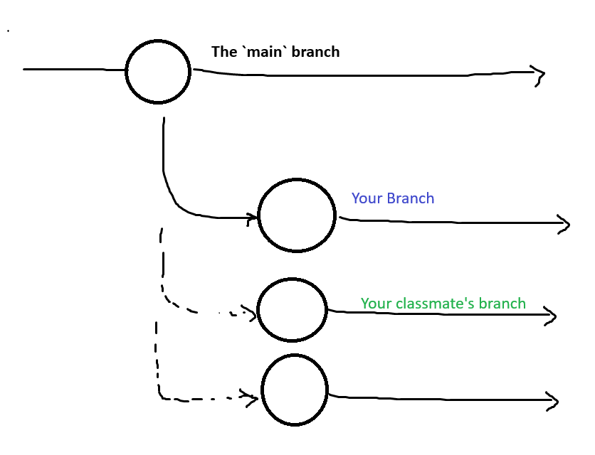

# Git Lab: Getting Started with Version Control

Welcome to the Git Lab\! This hands-on exercise will guide you through the fundamental concepts and commands of Git. By the end, you'll be able to clone a repository, make changes, and push them back.

-----

## 1\. Setup

### a. Install Git

First, you'll need to install Git on your computer.

  * **macOS:** Open your terminal and use Homebrew by typing `brew install git`.
  * **Windows:** Download and run the installer from the [Git for Windows website](https://git-scm.com/download/win).
  * **Linux (Ubuntu/Debian):** Open a terminal and run `sudo apt-get install git`.

### b. Configure Git

**From now on, try to use the command line instead of opening file explorer**

**For macOS/Linux, open the terminal. Windows has 2 cmdlets, open POWERSHELL and not cmd**

Next, set your username and email. Git attaches this information to all your commits, so it's essential for tracking who made what changes.

```bash
git config --global user.name "Your Name"
git config --global user.email "youremail@example.com"
```

-----

## 2\. Fork the Repository

### a. Fork the Repo

By default, you likely can't edit my repo and form your own branches directory. You need to "fork" the repo, and this is standard if you ever want to contribute to Open Source projects!

It's basically like creating a deep copy of this repo, then renaming it 

### b. Clone the Repo

A **repository** is a project that Git tracks. To get a local copy of our example project, use the `git clone` command. This downloads the entire project history.

**Note:** Please replace `<your username>/Git-ProjectManagement` with the actual path to your repository.

```bash
git clone https://github.com/<your username>/Git-ProjectManagement.git
```

### c. Navigate into the Directory

After cloning, a new folder with the same name as the repository will be created. Use `ls` to see your current directory:

```bash
ls
```

Then use the `cd` command to enter the new repo you cloned.

```bash
cd Git-ProjectManagement
```

-----

## 3\. Getting Familiar

Awesome! You're in a git repo. Look around! Run `ls` to see your current directory

```bash
ls
```

The `git status` command is your best friend. It shows you the current state of your working directory and staging area, indicating which files have been modified, are staged for a commit, or are untracked.

```bash
git status
```

Notice that you're on the `main` branch

```
On branch main
Your branch is up to date with 'origin/main'.
```

## 4\. The Plan

I want you to make your own branch. Visually it's like this:



Think of working with Git like collaborating on a research paper. Here's how the workflow maps out:

1. **The Original Paper (Your Repository)**  
   Imagine there's a published research paper — this is your GitHub repository. It contains all the original work.

2. **Making Your Own Copy (Forking)**  
   You want to contribute, so you make a personal copy of the paper in a Word Doc — this is your **fork**. Now you can edit without affecting the original.

3. **Creating a Safe Workspace (Branching)**  
   Before editing, you create a checkpoint in your Word doc — this is your **branch**. It lets you experiment freely, knowing you can always go back.

4. **Editing the Paper (Add/Commit/Push)**  
   You fix typos, improve phrasing, and make changes. Each time you save your progress, you're doing a **commit**. When you're ready to share, you **push** your changes to your online copy.

5. **Submitting Your Edits (Pull Request)**  
   You email the researchers your revised version, suggesting they incorporate your changes — this is a **pull request (PR)**. If they agree, your edits get merged into the original paper.

## 5\. Checkout

So start with making the branch. I also want you to practice a common GitOps behavior you'll see at work and in Open Source.

Name your branch "\<your name\>/\<what youre doing\>"

```bash
# For instance, I will make mines `git checkout -b "phuthai/GitPractice"
git checkout -b "<branchname>"
```

Now run `git status`. Make sure you see that you're on your new branch!

```bash
git status
```

## + Scenarios

Now move on to the scenarios. Depending on your operating system, go inside the `windows_scenarios` (Windows)
or `unix_scenarios` (macOS, Linux)

(remember the commands `ls` and `cd` if you're navigating via the command line)

