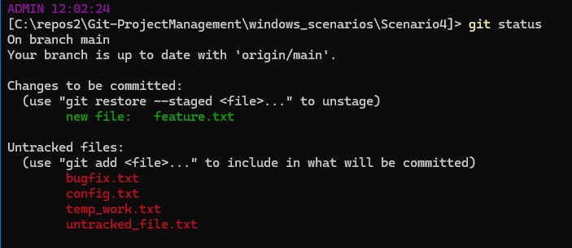
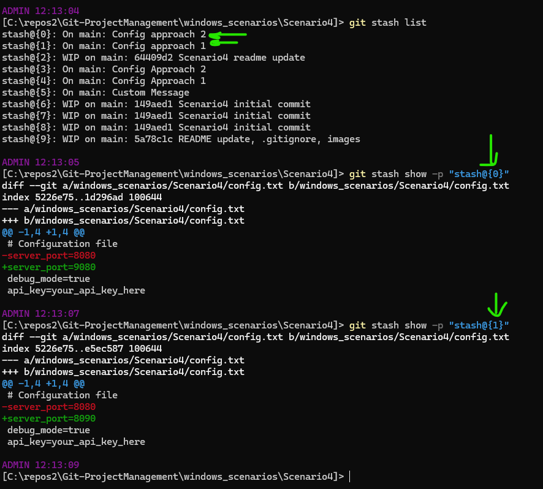
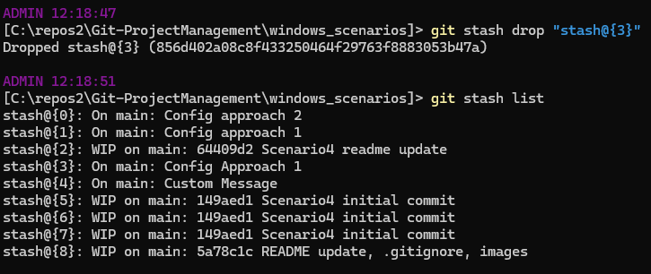
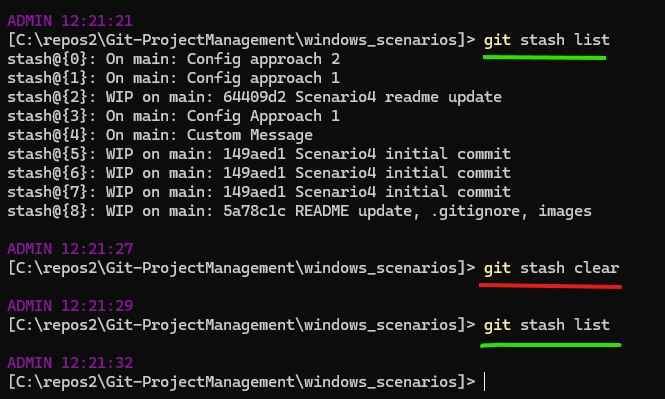

# Scenarios!

Each bash script here will create a new scenario for practicing Git commands on Unix-like systems (Linux/macOS).

Run `chmod +x *.sh */*.sh` to make the bash scripts executable if needed.

**Note**: These scripts are designed for Unix-like systems. For Windows, use the `windows_scenarios` directory instead.

-----

## Getting Familiar

### Add, Commit, Push 

Let's push your first change!

1. Run `git status`. Take note of the output

2. Create a file, could be named anything. 

3. Run `git status`. See how git has taken note of the changes!

4. Run `git add <path to the file from the red line in git status>` (or you can run `git add --all`)

5. Run `git status`. See how the red text became green! Anything that is green is staged for committing

6. Run `git commit -m "I created a new file"` (could be any commit message)

7. Run `git status`. See how the green text was replaced by your stored commit message?

8. Run `git push`. If the commandline tells you that you need to copy and paste a line, do it. You should see a success message afterwards. Now your changes are tracked remotely in git!!

In summary, `git add ...`, `git commit ...`, `git push` with some `git status` sprinkled everywhere

-----

## 1\. Scenario 1 | more add/commit/push practice

1. Go inside `Scenario1` directory and run `./Scenario1.sh` (note that you can tab-complete files and directories)

2. You'll see that a few files were created. Run `git status` to see them

3. Add, Commit, and Push all the changes

Before continuing, make sure that `git status` no longer shows files in red/green

1. Delete the "DeleteMe#.txt" files

2. Finish the math equation in "EditMe.txt"

3. Only push the changes for DeleteMe1.txt and EditMe.txt

Your end goal is having DeleteMe1.txt and EditMe.txt pushed, with the other files still in red with git status. Sometimes while coding, you have changes you dont want to commit yet.

Note how the `DontDeleteMe.txt` doesnt show up in `git status`, it's already committed/pushed in the repo!

-----

## 2\. Scenario 2 | Restoring

1. Navigate to the directory `Scenario2`, and run `./Scenario2.sh` like you did in Scenario 1

2. Run `git add --all`

3. OH NO! You accidentally staged a `TestPassword.txt` file that you dont want committed to the repo. To move it back from staged (green) to unstaged (red), run `git restore --staged "thefilename"` (replace the filename)

4. OH NO! You also staged my `Scenario2.sh`, this time with changes! I want you to revert the file back to its original state found in git. To do this, unstage the staged file. Then run `git restore "thefilename"` (replace the filename

5. Finally unstage that RestoreMe2.txt file. Once your git status looks like this:

Then feel free to commit/push

-----

## 3\. Scenario 3 | gitignores

Sometimes when you code, you get files you dont want to commit ever, but it's a huge hassle. For instance, building in some C# projects yields hundreds of build files that live around in directories all over your project. A `.gitignore` file will make git ignore any file from being added/committed

1. Navigate to the directory `Scenario3`, and run `./Scenario3.sh` 

2. Modify the `.gitignore` file to ignore all the IgnoreMe#.txt files. Your end goal is just seeing the DontIgnoreMe.txt files when you run `git status`. Feel free to use Bing or CoPilot to help you out. Bonus points if you write it in 1 line via regex.

3. This is the goal state:

Notice how the `IgnoreMe#.txt` files still exist in the file explorer, AND it doesn't show up at all in `git status`. If you've achieved this, feel free to commit/push

-----

## 4\. Scenario 4 | Git Stash Practice

`git stash` is one of the most underrated Git tools, that even many professionals don't utilize. It temporarily saves your work without committing it. This is incredibly useful when you need to quickly switch branches, pull updates, or work on something else while your current work is incomplete. It prevents you from making the more dangerous and confusing `git reset...` or `git revert...` commands in the future.

In summary, imagine that whenever you run `git stash`, you store green changes in a backpack, ready to be reapplied anytime.

### Part 1: Basic Stash Operations

1. Navigate to the directory `Scenario4`, and run `./Scenario4.sh`

2. Run `git status` to see all the new files created

3. **Basic Stash**: Add and modify some files, then practice basic stashing:
   - Run `git add feature.txt bugfix.txt` to stage some files
   - Modify `config.txt` by changing the port number to 9090
   - Run `git status` - you should see staged and unstaged changes
   - Run `git stash -m "Custom Message"` to stash both staged and unstaged changes
   - Run `git status` - your working directory should be clean!

4. **View Stash List**: Run `git stash list` to see stashed changes. See how your "backpack" of stashed contains one with your Custom Message message.

5. **Apply Stash**: In the stash list, take note of the stash number. Run `git stash apply stash@{n}` to restore your changes 

For example, let's say my backpack has a bunch of stashes, and I wanted to apply a stash I did a couple stashes ago, I'd do:

In the end, your flow should look something like this:

### Practice Scenarios

Try these real-world scenarios:

**Scenario A**: Clean up your workspace

You could clean up workspaces by manually reverting files, running `git clean -xf` (kinda dangerous), or simply by stashing them!

1. Hopefully your working directory still looks messy, if not- run the Scenario4.sh file again

2. Add all the files
3. Run `git stash`
4. Running `git status` or `ls` would show that your directory looks like your main branch!

This is super helpful nowadays with Agentic AI, which can make changes without your approval. As long as you have a good checkpoint and stash, you'll easily manage unwanted changes!

**Scenario B**: You want to experiment with different approaches

1. Run the `Scenario4.sh` file again if your changes have been stashed or the files no longer exist
2. Add, commit, push, so that your remote branch has the files

3. Make changes to `config.txt` (could be random text), and add the file
4. Stash them: `git stash push -m "Config approach 1"`
5. Write different changes to the same file and add the file
6. Stash that too: `git stash push -m "Config approach 2"`
7. Compare both approaches using `git stash show -p "stash@{#}` on different stashes, replacing the `#` symbol with the stash number you want from `git stash list`

**Scenario C**: You want to clean your "backpack" of stashes

1. Let's say your stash list gets messy in the future like mines:

2. Run `git stash drop "stash@{#}` on a stash you want to remove. You'll see that it disappears:

3. If you run `git stash clear`, all of your stashes are removed!

